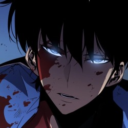

#  Creative Idea and Cool Stuff

  

  

<h3>
Hi there !  I'm a passionate Frontend Developer 
  
 with a keen eye for beautiful user interfaces. While I primarily specialize in creating stunning frontend experiences 
   
   , I've also been on an exciting journey to learn Java
    
    for backend development.🌟
</h3>

<h2> ⚡ Tech Stack</h2>
    

    
    
    
         
    
    
        
    
    
         
      

     

  
  
  
    
    
     
  
    
      
    
    
    
     
      
    

   

<h2> My GitHub Stats</h2>

  

<h2> Buy me coffe☕😎</h2>

<h2> See you soon👀😏👋🏾</h2>

